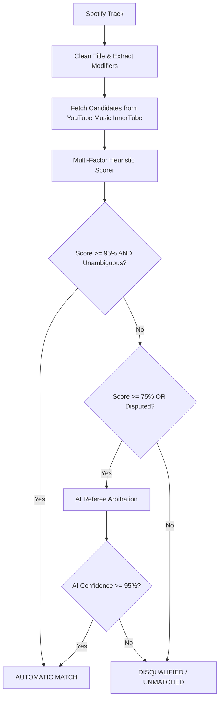

# 🎵 yt-import

> **High-Precision Spotify to YouTube Music Importer with AI Referee Arbitration & Interactive Terminal UI**

[](https://go.dev/)
[](LICENSE)
[](#-installation--downloads)
[](#-matching-strategy--precision-guarantee)
[](#-ai-referee-providers)
[](#-usage)

`yt-import` is a command-line tool built in **Go** that migrates playlists from **Spotify** into **YouTube Music** with an uncompromising **$\ge 95\%$ matching precision guarantee**. It guarantees you never get the wrong live version, tribute cover, remix, or video skit instead of the genuine studio track.

---

## 📦 Installation & Downloads

Pre-built binaries are available for Windows, macOS, and Linux on the GitHub [Releases](../../releases) page:

| Operating System | Architecture | Package |
| :--- | :--- | :--- |
| **Windows** | x86_64 (64-bit) | `yt-import_windows_amd64.zip` |
| **Windows** | ARM64 | `yt-import_windows_arm64.zip` |
| **macOS** | Apple Silicon (M1/M2/M3/M4) | `yt-import_darwin_arm64.tar.gz` |
| **macOS** | Intel (x86_64) | `yt-import_darwin_amd64.tar.gz` |
| **Linux** | x86_64 | `yt-import_linux_amd64.tar.gz` |
| **Linux** | ARM64 (aarch64) | `yt-import_linux_arm64.tar.gz` |

### Install via Go
```bash
go install ./cmd/yt-import
```

### Build from Source
```bash
# Clone and build locally
git clone https://github.com/raticulous/yt-import.git
cd yt-import
go build -o yt-import ./cmd/yt-import

# Or cross-compile all platforms to ./dist:
# Windows (PowerShell):
./scripts/build-releases.ps1
# Linux / macOS:
./scripts/build-releases.sh
```

---

## ✨ Features

- 🎯 **Strict $\ge 95\%$ Precision Guarantee**:
  - Multi-factor scoring ($35\%$ Title, $30\%$ Artist, $25\%$ Duration Delta, $10\%$ Video Type).
  - Hard disqualification filters for Live, Acoustic, Remix, Instrumental, Karaoke, and Cover versions when the source is studio audio.
  - Automatically prioritizes official distributor audio tracks (`MUSIC_VIDEO_TYPE_ATV` / Topic channels) over user-uploaded music videos.
- 🤖 **AI LLM Referee Layer**:
  - Automatically arbitrates ambiguous matches or near-threshold candidate ties ($0.75 \le \text{Score} < 0.95$).
  - **Antigravity Login (Default)**: Uses your active Antigravity CLI/IDE session (`agy`) — **Zero API keys required!**
  - Also supports **Local Ollama** (100% free & offline), **Google Gemini** (free tier), **OpenAI**, and **Claude**.
- ⚡ **Lightning Fast Playlist Deduplication**:
  - Inspects what is already inside your target YouTube Music playlist and skips duplicates in `<0.001ms` without making redundant searches or calling the AI Referee!
- 🆕 **Automatic YouTube Music Playlist Creation**:
  - Leaving the destination playlist blank automatically creates a new YouTube Music playlist matching your Spotify playlist title.
- 📑 **Offset & Limit Slicing**:
  - Process playlists in manageable chunks (e.g. migrate tracks 0–50 today, 50–100 tomorrow) or import the entire playlist at once.
- 💻 **Stunning Interactive Terminal UI**:
  - Interactive setup wizard powered by [Charm Huh](https://github.com/charmbracelet/huh).
  - Live progress dashboard with spinner, progress bar, match rate counter, and real-time activity log powered by [Bubble Tea](https://github.com/charmbracelet/bubbletea).
- 🧪 **Dry-Run & Test-Match Modes**:
  - Preview match candidates and confidence scores without making any changes to your YouTube Music library.
- 📊 **Audit Reports**:
  - Generates detailed Markdown reports (`import_report.md`) and JSON dumps of unmatched songs (`unmatched.json`) with reasons for full transparency.

---

## 🚀 Quick Start

### 1. Build the Binary

```bash
# Clone repository and build with Go 1.27
git clone https://github.com/your-username/yt-import.git
cd yt-import
go build -o yt-import.exe ./cmd/yt-import
```

*(On Linux/macOS, use `go build -o yt-import ./cmd/yt-import`)*

### 2. Launch Interactive Wizard

Simply execute the binary without arguments to start the interactive Charm TUI wizard:

```bash
./yt-import.exe
```

> 🎉 **Zero Credentials Required**: As long as your Spotify playlist is **public** (any playlist link you can share or open in a browser), you do **not** need a Spotify Developer account, Client ID, or Access Token! `yt-import` fetches public playlists directly out of the box.

The wizard will guide you through:
1. Entering your **Spotify Playlist URL** (e.g., `https://open.spotify.com/playlist/37i9dQZF1DXcBWIGoYBM5M`)
2. Entering your **YouTube Music Playlist URL** (or leaving blank for dry-run simulation)
3. Setting an **Offset** and **Limit** (default: `0` / all tracks)
4. Selecting the **Strict Threshold** (default: `95%`)
5. Choosing your **AI Referee Provider** (`antigravity` by default — no API keys needed!)
6. Toggling **Dry Run Mode**

---

## 🔑 Credentials & Authentication

### 1. Spotify (Public Playlists - Zero Setup!)
- **Public Playlists (Default)**: **No credentials required!** Just paste any public Spotify playlist URL.
- **Private Playlists (Optional)**: If you want to access your private library playlists or sync massive playlists (> 100 tracks in a single batch):
  1. Go to the [Spotify Developer Dashboard](https://developer.spotify.com/dashboard).
  2. Create a free app and copy the **Client ID** and **Client Secret**.
  3. Set `$env:SPOTIFY_CLIENT_ID="your_id"` and `$env:SPOTIFY_CLIENT_SECRET="your_secret"`.

---

### 2. YouTube Music Setup
To add songs directly to your private YouTube Music playlists:
1. Open [music.youtube.com](https://music.youtube.com) in Chrome / Edge / Firefox while logged in.
2. Press `F12` to open Developer Tools $\to$ go to the **Network** tab.
3. Click any song or playlist $\to$ select a network request to `music.youtube.com` (e.g., `browse` or `next`).
4. Under **Request Headers**, copy the full value of the `cookie:` header.
5. Set the environment variable:
   ```bash
   $env:YTM_COOKIE="your_full_cookie_string"
   ```

> 💡 **Note**: If you only want to test matching without inserting into YouTube Music, you can run in **Dry Run mode** without needing a YouTube Music cookie!

---

### 3. AI Referee Providers

| Provider | Authentication | Cost | Setup |
| :--- | :--- | :--- | :--- |
| **Antigravity** *(Default)* | **Uses local Antigravity session (`agy`)** | **Included** | **Zero setup!** Detects `agy.exe` automatically. |
| **Local Ollama** | Local daemon | **100% Free / Offline** | Install [Ollama](https://ollama.ai) and run `ollama run llama3`. |
| **Google Gemini** | `GEMINI_API_KEY` | **Free tier** | Get a free API key at [Google AI Studio](https://aistudio.google.com/apikey). |
| **OpenAI** | `OPENAI_API_KEY` | Paid / API credits | `gpt-4o-mini` |
| **Anthropic Claude** | `ANTHROPIC_API_KEY` | Paid / API credits | `claude-3-5-haiku` |
| **Mock Referee** | None | Free | Used for testing and instant dry runs without network calls. |

---

## 🛠️ CLI Command Reference

### `yt-import run` (or `./yt-import.exe`)
Launches the full interactive Charm TUI wizard and live migration dashboard.

---

### `yt-import sync`
Runs the migration in headless or scriptable CLI mode.

```bash
# Dry run migration for first 25 songs
./yt-import.exe sync \
  --source "https://open.spotify.com/playlist/37i9dQZF1DXcBWIGoYBM5M" \
  --offset 0 \
  --limit 25 \
  --threshold 0.95 \
  --ai-provider antigravity \
  --dry-run

# Full migration to a target YouTube Music playlist in headless mode
./yt-import.exe sync \
  --source "https://open.spotify.com/playlist/37i9dQZF1DXcBWIGoYBM5M" \
  --target "https://music.youtube.com/playlist?list=PL..." \
  --headless \
  --report import_report.md
```

#### Flags:
- `-s, --source <url>`: Spotify playlist URL or ID *(Required)*.
- `-t, --target <url>`: YouTube Music playlist URL or ID.
- `-c, --concurrency <n>`: Number of parallel evaluation workers (default: `5`). Preserves exact playlist ordering.
- `--offset <n>`: Starting track index (default: `0`).
- `--limit <n>`: Number of tracks to process (default: `0` for all).
- `--threshold <f>`: Match confidence threshold from `0.50` to `1.0` (default: `0.95`).
- `--ai-provider <name>`: `antigravity`, `gemini`, `openai`, `claude`, `ollama`, or `mock` (default: `antigravity`).
- `--gemini-api-key <key>`: Google Gemini API key (or `$env:GEMINI_API_KEY`).
- `--openai-api-key <key>`: OpenAI API key (or `$env:OPENAI_API_KEY`).
- `--dry-run`: Evaluate matches without inserting into YouTube Music.
- `--headless`: Plain-text logging without the interactive TUI.
- `--report <path>`: Markdown report output file (default: `import_report.md`).

---

### `yt-import test-match <title> <artist>`
Inspect YouTube Music search candidates and score calculations for any song.

```bash
./yt-import.exe test-match "Bohemian Rhapsody" "Queen"
```

**Example Output:**
```text
Inspecting candidates for: 'Bohemian Rhapsody' by Queen...

Found 3 candidate(s):

[Candidate 1]
  Video ID:        -tJYN-eG1zk
  Title:           Bohemian Rhapsody
  Artist:          Queen
  Duration:        5:54
  Type:            ATV (Official Audio Track)
  Channel:         Queen - Topic
  Total Score:     98.80% (PASS >= 95.0%)
  Breakdown:       Title: 100.0% | Artist: 100.0% | Duration: 98.4% | Type: 100.0%
```

---

### `yt-import config`
Prints the current configuration file path, active settings, and detected credentials.

```bash
./yt-import.exe config
```

---

## 🎯 Matching Strategy & Precision Guarantee

For full technical specifications, see [docs/MATCHING_STRATEGY.md](docs/MATCHING_STRATEGY.md).



### Scoring Formula:
$$\text{Score} = (0.35 \times S_{\text{title}}) + (0.30 \times S_{\text{artist}}) + (0.25 \times S_{\text{duration}}) + (0.10 \times S_{\text{type}})$$

### Critical Disqualification Rules:
- **Modifier Mismatch**: If the source track is a standard studio release, candidates containing `Live`, `Acoustic`, `Cover`, `Remix`, `Instrumental`, or `Karaoke` are immediately disqualified ($0.0$ score).
- **Duration Delta Penalty**: Official digital audio masters rarely differ by more than 1–3 seconds. Candidates differing by more than 15 seconds receive a steep exponential penalty.
- **Audio Track Priority**: Candidates with classification `MUSIC_VIDEO_TYPE_ATV` (Album Track Video / Topic Channel) are given full type score, avoiding official music videos with extended dialogue or intro skits.

---

## 📚 Technical Documentation

- [docs/ARCHITECTURE.md](docs/ARCHITECTURE.md): System design, package responsibilities, and data flow.
- [docs/MATCHING_STRATEGY.md](docs/MATCHING_STRATEGY.md): Full breakdown of the 95% algorithm, string metrics, and normalization rules.
- [docs/AI_REFEREE.md](docs/AI_REFEREE.md): AI Referee system prompts, JSON response schemas, and arbitration rules.
- [docs/PROVIDERS.md](docs/PROVIDERS.md): Detailed authentication instructions for Spotify and YouTube Music.

---

## 🛡️ License

This project is licensed under the [MIT License](LICENSE).
