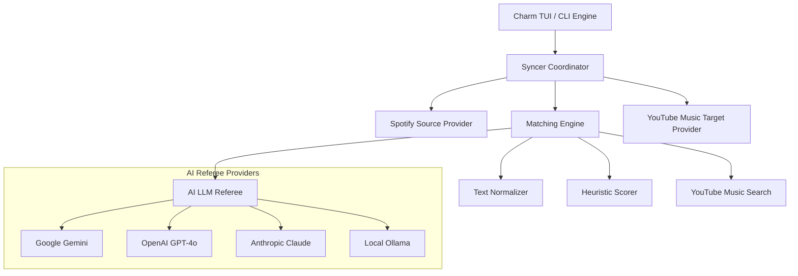

# System Architecture: `yt-import`

`yt-import` is an extensible, high-precision music migration tool written in Go (Go 1.27) designed to transfer playlists and track libraries between streaming platforms—starting with **Spotify** to **YouTube Music** (V1), with bidirectional architecture.

---

## 1. High-Level Architecture Overview



---

## 2. Core Packages & Folder Structure

Following standard Go application layout:

```
yt-import/
├── cmd/
│   └── yt-import/
│       └── main.go                 # Cobra CLI entry point & subcommands
├── internal/
│   ├── domain/                     # Pure domain models (Track, Playlist, MatchResult, etc.)
│   ├── config/                     # Configuration persistence (~/.config/yt-import/config.json)
│   ├── matcher/                    # 95%+ precision song matching engine
│   │   ├── normalizer.go           # Text cleaning, remaster stripping, feat parsing
│   │   ├── metrics.go              # String algorithms (Levenshtein, Jaro-Winkler, Token Set)
│   │   ├── scorer.go               # Multi-factor score calculator & disqualification checks
│   │   ├── engine.go               # Search orchestration & decision pipeline
│   │   └── engine_test.go          # Unit tests covering difficult music edge cases
│   ├── referee/                    # AI LLM Disambiguation Referee
│   │   ├── referee.go              # Referee interface & factory
│   │   ├── prompt.go               # System prompt & structured JSON schema
│   │   ├── gemini.go               # Google Gemini provider
│   │   ├── openai.go               # OpenAI provider
│   │   ├── claude.go               # Anthropic Claude provider
│   │   ├── ollama.go               # Local Ollama provider
│   │   └── mock.go                 # Mock referee for offline/unit tests
│   ├── provider/                   # Music service abstraction layer
│   │   ├── provider.go             # SourceProvider & TargetProvider interfaces
│   │   ├── spotify/                # Spotify API client (OAuth2, pagination, offset/limit)
│   │   └── ytmusic/                # YouTube Music client (InnerTube search & playlist manipulation)
│   ├── syncer/                     # Orchestrates fetching, matching, and playlist insertions
│   └── tui/                        # Terminal User Interface (Charm: bubbletea, lipgloss, huh)
│       ├── styles.go               # Styling tokens, colors, layouts
│       ├── wizard.go               # Interactive Huh configuration wizard
│       ├── progress.go             # Bubbletea live sync dashboard
│       └── summary.go              # Post-sync summary and reporting
└── docs/                           # Technical documentation & reference specifications
    ├── ARCHITECTURE.md             # This document
    ├── MATCHING_STRATEGY.md        # Detailed matching math, weights, and rules
    ├── AI_REFEREE.md               # Prompt engineering, schemas, and provider config
    └── PROVIDERS.md                # Spotify and YouTube Music authentication guides
```

---

## 3. Data Flow & Lifecycles

1. **Configuration & Wizard**:
   The user launches `yt-import`. If options are not passed via CLI flags, an interactive `huh` form asks for:
   - Source playlist (Spotify ID or URL).
   - Target playlist (YouTube Music playlist ID, or name of new playlist).
   - `offset` (default: 0) and `limit` (default: 0 for all).
   - Confidence threshold (default: 95%).
   - AI Referee provider (Optional: Gemini, OpenAI, Claude, Ollama).

2. **Fetching with Pagination**:
   The `SpotifyClient` queries playlist metadata and fetches tracks in pages of up to 100 items, adhering to `offset` and `limit`.

3. **Matching Pipeline**:
   For each source track:
   - Metadata is cleaned and normalized.
   - YouTube Music is queried (Tier 1: ISRC; Tier 2: `filter: songs` official audio; Tier 3: General fallback).
   - Candidates are evaluated against the source track using heuristic scoring (Title, Artist, Duration Delta, Video Type).
   - If candidate score $\ge 0.95$ and unambiguous lead: **Auto-Match**.
   - If candidate score is $0.75 - 0.94$ or top candidates are tied: **AI Referee** arbitrates.
   - If no candidate meets the threshold: **Skip** (never import false positives).

4. **Playlist Insertion**:
   Matched track IDs are queued and added to the destination YouTube Music playlist.

5. **Reporting**:
   Progress is rendered live via Bubble Tea. Upon completion, a summary table is shown and an optional `import_report.md` / `unmatched.json` can be exported.
