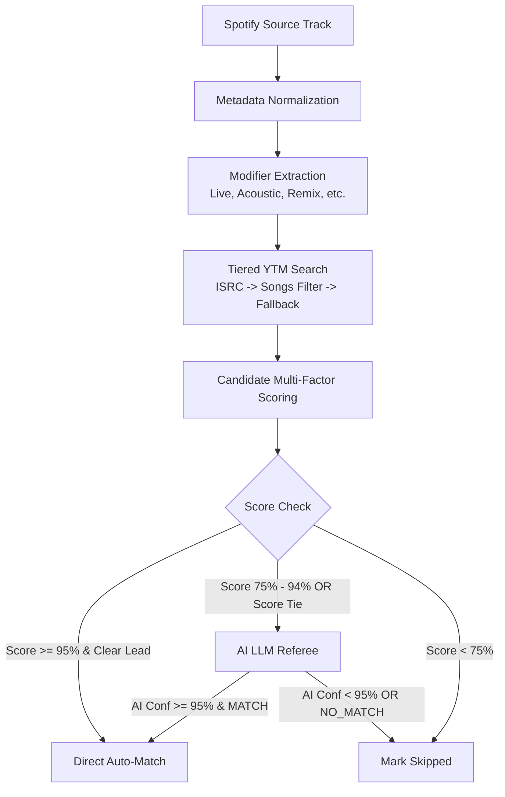

# Song Matching Strategy & 95% Precision Rules

The primary challenge in music library migration is eliminating false positives. Traditional tools frequently import incorrect tracks (e.g. live recordings instead of studio versions, acoustic covers, karaoke backing tracks, remixes, or fan video uploads with extended skits).

`yt-import` enforces a strict **$\ge 95\%$ confidence standard**. Any candidate that fails to meet this threshold—either through algorithmic heuristics or AI referee arbitration—is safely skipped.

---

## 1. Multi-Stage Pipeline

---

## 2. Normalization & Modifier Extraction

### A. Title Noise Stripping
The normalizer removes non-essential noise while preserving distinguishing characteristics:
- **Remaster tags**: `- Remastered 2011`, `(2020 Remaster)`, `[Deluxe Edition]`
- **Video noise**: `[Official Video]`, `(Official Audio)`, `[4K UHD]`, `(Lyric Video)`
- **Soundtrack info**: `- From "Film" Soundtrack`, `(From The Motion Picture ...)`
- **Parenthetical features**: `(feat. Drake)` $\to$ artist extracted into artist pool.

### B. Version Modifier Rules (Disqualification Criteria)
Modifiers define distinct musical recordings. If the source does not request a specific modifier, a candidate containing that modifier receives an **immediate score of 0.0**:

| Modifier | Disqualification Rule |
| :--- | :--- |
| `Live` | If source is NOT live, candidate with "Live" is disqualified. |
| `Acoustic` | If source is NOT acoustic, candidate with "Acoustic" / "Unplugged" is disqualified. |
| `Remix` | If source is NOT remix, candidate with "Remix" / "Club Mix" is disqualified. |
| `Instrumental` | If source is NOT instrumental, karaoke/instrumental is disqualified. |
| `Cover / Tribute` | Tribute and cover recordings are disqualified unless source is a cover. |
| `Slowed / Reverb` | Fan edits ("Slowed + Reverb", "Nightcore", "8D Audio") are disqualified. |

---

## 3. Candidate Scoring Formula

Each candidate is evaluated across four primary dimensions:

$$\text{FinalScore} = (W_{\text{title}} \times S_{\text{title}}) + (W_{\text{artist}} \times S_{\text{artist}}) + (W_{\text{duration}} \times S_{\text{duration}}) + (W_{\text{type}} \times S_{\text{type}})$$

### Dimension Weights:
- $W_{\text{title}} = 0.35$ (35%)
- $W_{\text{artist}} = 0.30$ (30%)
- $W_{\text{duration}} = 0.25$ (25%)
- $W_{\text{type}} = 0.10$ (10%)

### 1. Title Similarity ($S_{\text{title}}$)
Calculated using a hybrid of **Token Set Ratio** and **Levenshtein Distance**:
- Token Set Ratio handles word ordering differences (`Artist - Title` vs `Title - Artist`).
- Normalized exact match = $1.0$.

### 2. Artist Overlap ($S_{\text{artist}}$)
Calculated as the Jaccard similarity across normalized token sets of source artists (primary + featured) and candidate authors/channels:
- Primary artist must match with $\ge 0.85$ similarity, otherwise score receives a steep penalty.
- Official `"- Topic"` suffixes are stripped before comparison.

### 3. Duration Delta ($S_{\text{duration}}$)
Duration is one of the most reliable discriminators between studio tracks and music videos / concert recordings:
- $|\Delta t| \le 2\text{s} \implies 1.0$ (Official digital masters across platforms match within 1–2 seconds)
- $|\Delta t| \le 4\text{s} \implies 0.85$
- $|\Delta t| \le 8\text{s} \implies 0.50$
- $|\Delta t| \le 12\text{s} \implies 0.20$
- $|\Delta t| > 15\text{s} \implies 0.0$

### 4. YouTube Track Type ($S_{\text{type}}$)
YouTube Music InnerTube data provides a critical metadata field: `musicVideoType`.
- **`MUSIC_VIDEO_TYPE_ATV`** (Audio Track Video): **$1.0$**. This represents the official studio audio provided directly by music labels/distributors.
- **`MUSIC_VIDEO_TYPE_OMV`** (Official Music Video): **$0.7$**. Often contains intro/outro video audio.
- **`MUSIC_VIDEO_TYPE_UGC`** (User Generated Content): **$0.2$**. Unofficial uploads.

---

## 4. Decision Thresholds

- **Score $\ge 0.95$ and $\Delta \text{Score}_{\text{2nd}} \ge 0.05$**: Auto-Accepted.
- **Score $\in [0.75, 0.94]$ OR Candidate Tie ($\Delta \text{Score}_{\text{2nd}} < 0.05$)**: Sent to AI Referee.
- **Score $< 0.75$**: Disqualified / Skipped.
